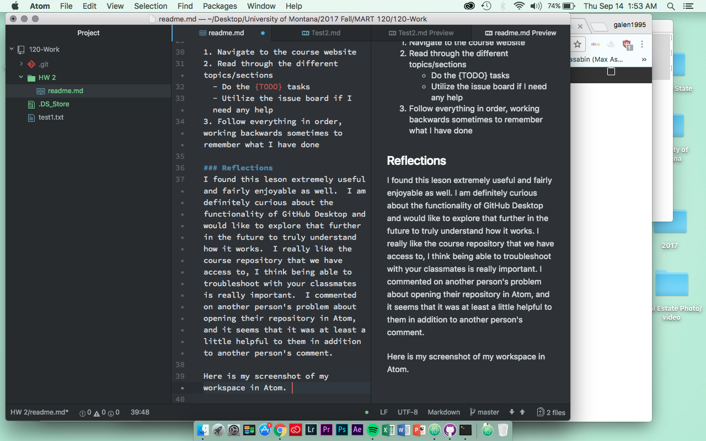
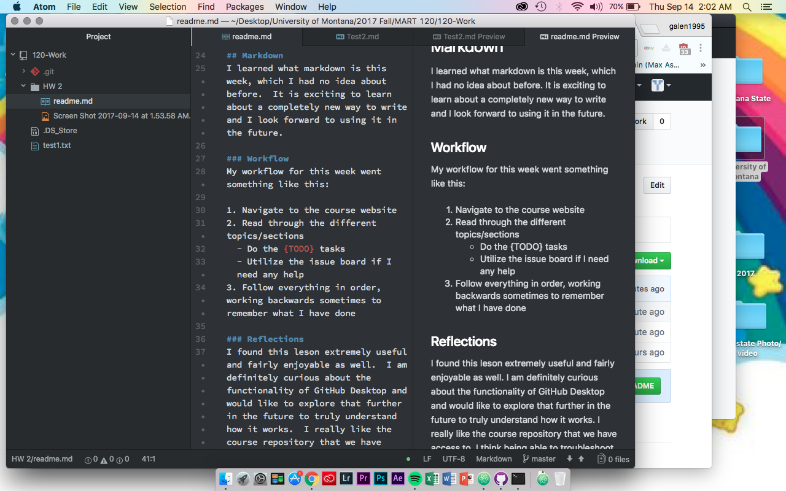

#### _Galen Koon 50_

# Week Two
This week I got through the basics of a few different programs, accomplishing certain goals with each one.  This is my first time ever writing in code, and it is not without its challenges, but I'm enjoying it so far.  The week culminated in this homework assignment written using markdown, which I have thoroughly enjoyed.  I have chosen to format it in this way, with the header size decreasing as we work our way down the page, from the all encompassing "week two" to the breakdown of topics and finally to my reflections.

Here is what I did this week, broken down in topics.

## Atom
This was extremely difficult at first for me, because I was having difficulty even opening files into it and getting it to run smoothly.  Everytime I would try and open my repo in Atom I would get a message saying it couldn't be done.  I googled the issue and couldn't exactly find what I was looking for, although I did scope around some forums like [this](https://discuss.atom.io/t/atom-not-recognizing-git-repository/20130).  I eventually just uninstalled it and reinstalled it, which is what @Glossyy did in her issue post on GitHub.  I have had no issues since, and I am having fun navigating Atom. I did not post on the course repo because I was able to solve my problem without posting.

## GitHub Desktop
This is a cool program that I am still trying to figure out.  It seems that it acts as a middle-man in the storage chain from my hard-drive to the cloud.  [This chart](https://guides.github.com/introduction/flow/) was helpful in breaking up the process and showing me how GitHub Desktop is storing my changes along the way.  This also delves into git version control, which I think will be an extremely useful feature.

## Text Files and Repositories
I learned what a text file was this week, and about the different ways that one can edit, create, and store text files.  I had no idea how Microsoft Word actually worked, so it was interesting to come away with a more in-depth understanding of that.  I actually really struggled to, initially, create my 120-Work repository and store it where I wanted to.  In my terminal, I was typing the name of my folder, University of Montana, but I had forgotten that I needed to include backslashes and forward slashes in order to properly change.
```
cd University of Montana
-bash: cd: University: No such file or directory
 cd /University of Montana
-bash: cd: /University: No such file or directory
 cd University\ of\ Montana/
```

## Markdown
I learned what markdown is this week, which I had no idea about before.  It is exciting to learn about a completely new way to write and I look forward to using it in the future.

### Workflow
My workflow for this week went something like this:

1. Navigate to the course website
2. Read through the different topics/sections
  - Do the {TODO} tasks
  - Utilize the issue board if I need any help
3. Follow everything in order, working backwards sometimes to remember what I have done

### Reflections
I found this leson extremely useful and fairly enjoyable as well.  I am definitely curious about the functionality of GitHub Desktop and would like to explore that further in the future to truly understand how it works.  I really like the course repository that we have access to, I think being able to troubleshoot with your classmates is really important.  I commented on another person's problem about opening their repository in Atom, and it seems that it was at least a little helpful to them in addition to another person's comment.

Here is my screenshot of my workspace in Atom.


Also, here is a screenshot of my code and the corresponding preview on the right.  It seems like in the preview the list shows up as I want it to, but in the readme.md preview in GitHub it doesn't.

